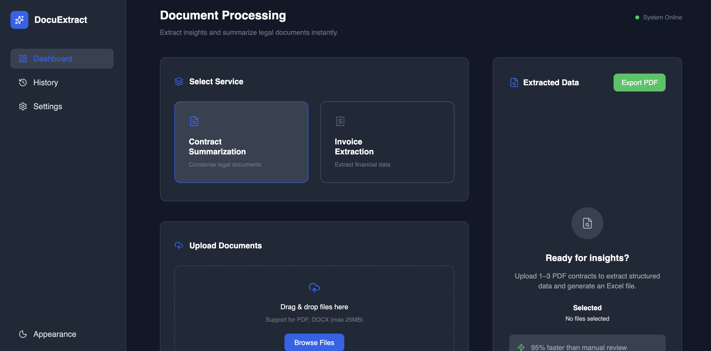
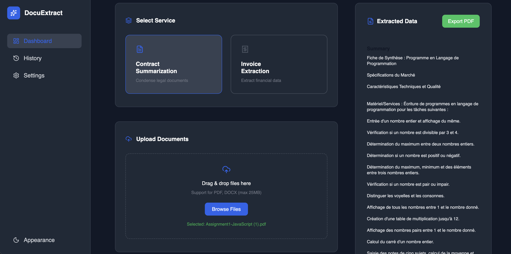
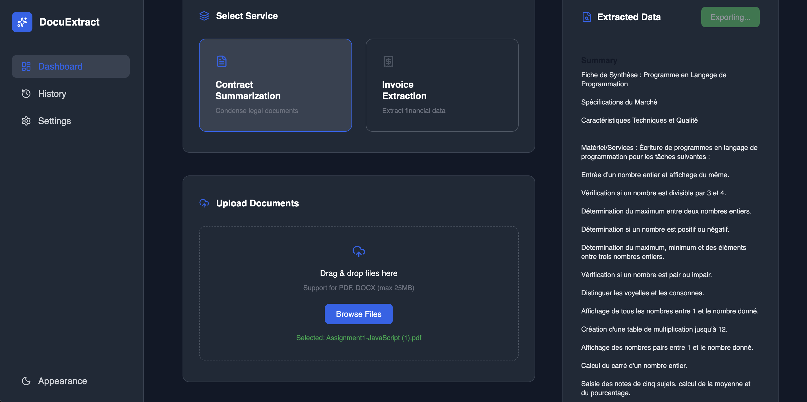
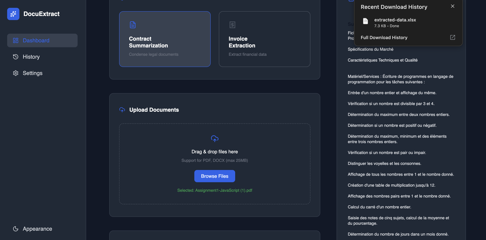

<div align="center">

# 📄 Docu-Extract

### Intelligent Document Processing & Extraction Web Application


</div>

---

## 📌 Overview

Docu-Extract is a modern web application built with **React + TypeScript** that allows users to process and analyze documents efficiently through API-powered extraction and summarization.

The system helps reduce manual review time and automate document workflows.

---

## ✨ Features

✔ Upload documents (PDF, DOCX, Excel)  
✔ Contract summarization  
✔ Invoice extraction  
✔ Sheet data extraction (downloadable output)  
✔ Real-time queue status tracking  
✔ Dark / Light mode toggle  
✔ Centralized Axios API configuration  
✔ Environment-based API setup  
✔ Clean and scalable architecture  

---

## 🛠 Tech Stack

| Technology | Purpose |
|------------|----------|
| React | Frontend Library |
| TypeScript | Type Safety |
| Vite | Build Tool |
| Axios | API Requests |
| Tailwind CSS | Styling |
| REST API | Backend Communication |

---

## 📂 Project Structure

```
src/
 ├── api/
 │    ├── client.ts
 │    └── documentApi.ts
 │
 ├── components/
 ├── pages/
 ├── config/
 ├── layout/
 └── main.tsx
```

---

## 📦 Installation

Clone the repository:

```bash
git clone <your-repository-url>
cd docu-extract
```

Install dependencies:

```bash
npm install
```

Run development server:

```bash
npm run dev
```

---

## ⚙ Environment Variables

Create a `.env` file in the project root:

```
VITE_API_BASE_URL=<your-backend-url>
VITE_API_TIMEOUT=400000
```

⚠️ Do not commit your `.env` file to GitHub.

---

# 📸 Application Screenshots

## 📄 Document Processing Dashboard



---

## 📊 Extracted Data View




---

---

## 🚀 Future Improvements

- Advanced progress indicators  
- Drag & Drop upload  
- Authentication system  
- Role-based access control  
- Deployment with Docker  
- Performance monitoring  

---

## 🧑‍💻 Author

Developed as part of an internship task.


---

<div align="center">

⭐ If you like this project, consider giving it a star!

</div>